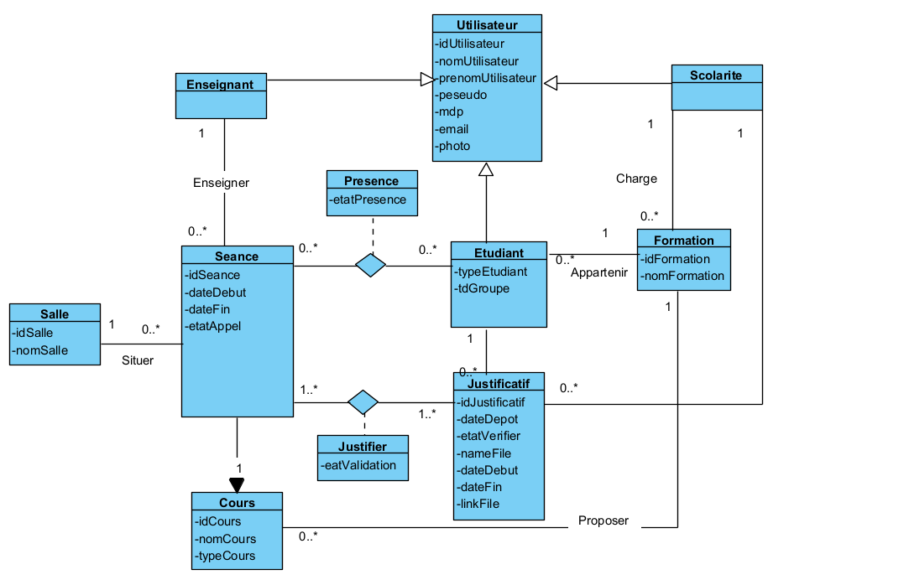

# AppelProjet

# ABOUT PROJECT
#### [ GestionAppel ] Développement d'un site web en Java : Application de gestion de l'appel en ligne (Inscription, Connexion, )  *( 2021.03.21 ~ 2021.04.01 )*

## 1. Membres de l'équipe

|*Members*|*Contact*|
|:---:|---|
|**Yuni CHEN**| |
|**Jiayin LI**| |
|**Mengying ZHAO**| |
|**CLAUDEL FRANK**| |
|**Shuanghong LI**| |
## 2. Installation du projet
1. Préparer l’Intellij environnement
2. Copier l’url Github et import Projet
3. Configurer le tomcat en cliquant Add Configuration
(Notre projet utilise une base de données déploiée sur SKYSQL donc pas de configuration en plus) 
4. Adapdation de chemin d'accès 
      1. Rajouter le tomcat dans Application server
      3. Choix de la version Tomcat
      4. Choisir le projet correspodant dans le Déployement
5. Préparer un BD 'dai' local
      1. Modifier le fichier hibernate.cfg.xml en utilisant le nom et le mot de pass propre
      2. Run le file GenererBD.java seulement pour remplir les données dans le BD dai
7. Lancer tomcat

## 5. Technologie

### 5.1 APIs

**Technologie**

- Intellij : environnement de développement

- Tomcat : Serveur Web

- Hibernate : pour créer le BD, insérer les données, manipuler les tables

- mysql-connector-java-8.0.28 : pour connecter le BD MySQL

- Github : pour gérer les versions et facilité le travail en équipe

- Ajax : pour réaliser les pages dynamiques

**Libraire**

- Pour envoyer un mail automatique via APP:
    -javax.mail
    -jodd.all

- Pour upload et download les fiches:
   -commons-io-2.2
   -commons-fileupload-1.4

Remarque: Les libraires qui ont utilisé sont tous décrit dans les dépendances du projet sous file pom.xml

## 6. Diagramme de classe (uml)

